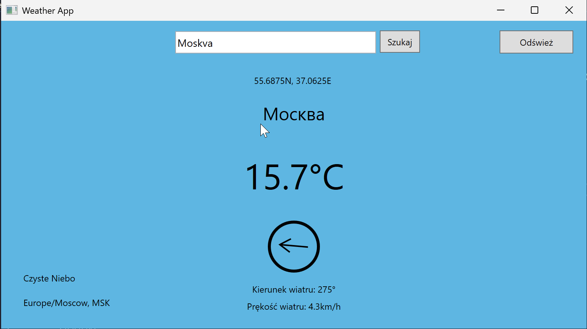
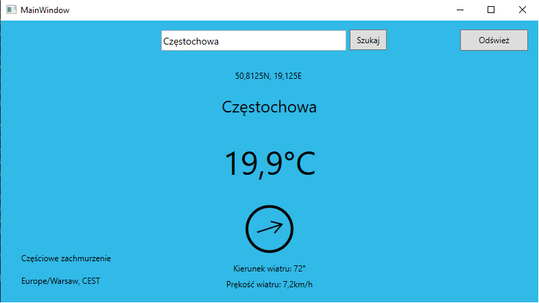

# Dokumentacja projektu

## Wybrany temat: Aplikacja pokazująca pogodę w zależności od wybranej lokacji

### Użyte API

Aplikacja używa dwóch API.

1. Pierwsze z nich to open-meteo.com. Wysyłane jest do niego szerokość i długość geograficzna, a zwracany jest dość skomplikowany(i w zależności od opcji w URL) obiekt JSON który jest odwzorowany klasą do której następuje deserializacja z JSONa. Pola muszą mieć dokładnie takie same nazwy jak w odpowiedzi JSON, inaczej nie zostaną zapisane do programu.

1. Drugie z nich to https://photon.komoot.io. Służy do przekonwertowania nazwy miejsca na współrzędne geograficzne, które wysyłam do open-meteo.com. Na ten moment(mogło ulec zmianie od pisania tego), niestety nie wyświetla się lista miejsc o tej samej nazwie a różnych. Kiedy wpiszemy Moscow, nie wyświetli się więc Moskwa, stolica Rosji, tylko jakieś miasteczko w USA. Musimy wpisać Moskva, a więc angielską nazwę.

   

### Działanie

Aplikacja ma zaimplementowane pobieranie i przypisywanie danych z API w projekcie BLL, który jest biblioteką klas WPF. Za pobieranie danych odpowiada wbudowana biblioteka HTTP(using System.Net.Http), za deserializację JSONa, biblioteka od NewtonSoftu, ponieważ systemowa miała problemy z tablicami. Klasy Weather is GeoCoding(oraz ich pochodne) są wymodelowane a ich pola nazwane według zwracanego obiektu typu JSON.

Zasada jest prosta. Jeżeli interesuje nas pewne pole z JSONa to tworzymy pole o takiej samej nazwie(także wielkość liter ma znaczenie), a podczas deserializacji funkcja automatycznie przypisze pola o tej samej nazwie. Na stronach obu API możemy znaleźć wzór przykładowego zwracanego obiektu. Tak więc obiekt z Open-Meteo wygląda mnie więcej tak:

```json
  "latitude": 52.52,
  "longitude": 13.419,
  "elevation": 44.812,
  "generationtime_ms": 2.2119,
  "utc_offset_seconds": 0,
  "timezone": "Europe/Berlin",
  "timezone_abbreviation": "CEST",
  "current_weather": {
    "time": "2022-07-01T09:00",
    "temperature": 13.3,
    "weathercode": 3,
    "windspeed": 10.3,
    "winddirection": 262
  }

```

więc klasa w C# będzie wyglądać tak:


```cs

public class Weather {
        public double latitude { get; set; }
        public double longitude { get; set; }
        public double generationtime_ms { get; set; }
        public int utc_offset_seconds { get; set; }
        public string timezone { get; set; }
        public string timezone_abbreviation { get; set; }
        public double elevation { get; set; }
        public CurrentWeather current_weather { get; set; }
	//[...]
	public Weather()
        {
            timezone = "";
            timezone_abbreviation = "GMT";
            current_weather = new CurrentWeather();
        }
}
```

Aby pobrać dane wysyłamy zapytanie GET na stronę i odbieramy odpowiedź, oraz następuje deserializacja do obiektu po szablonie klasy Weather.

```cs
HttpResponseMessage response = await client.GetAsync($"v1/forecast?latitude={lat}&longitude={lon}&current_weather=true&timezone=auto");

response.EnsureSuccessStatusCode();

var empResponse = await response.Content.ReadAsStringAsync();
weather = JsonSerializer.Deserialize<Weather>(empResponse);
```

Teraz możemy użyć danych w MainWindow.xaml.cs.

```csharp
public async Task loadApiAsync(double lat = 50.8, double lon = 19.7)    
{
            try
            {
                weather = await weather.getWeatherAsync(lat, lon);
                
            }
            catch (Exception ex) { }
  //[...]
}
```

Wywołujemy geoApi w konstruktorze, która pobiera miasto(domyślnie Częstochowa i zwraca dług. i szer. geograficzną, a następnie wywołujemy loadApiAsync, które ustawi wszystkie pola w GUI).

### GUI



GUI jest proste i składa się z kilku Pól typu Label, jednego TextBoxa, dwóch przycisków.

* **TextBox** - służy do wpisywania nazwy miasta. Na tym etapie nie rozwija się lista z której można wybrać konkretne miasto(jeżeli jest kilka o tej samej nazwie).

* **Przycisk Szukaj** - Do potwierdzenia wyszukania miasta. Można alternatywnie potwierdzić klawiszem enter.
* **Odśwież** - Odświeża dane na temat pogody.

Na ekranie widać też:

* Stan pogody,
* Strefę czasową
* Współrzędne geograficzne
* Nazwę miasta
* Temperaturę w stopniach Celsjusza
* Zwizualizowany kierunek wiatru
* Prędkość wiatru.

Aplikacja zmienia też kolor na ciemniejszy, przyjemniejszy dla oka w nocy kiedy zmienna z API is_day jest równa 0, a także w zależności od pogody.


