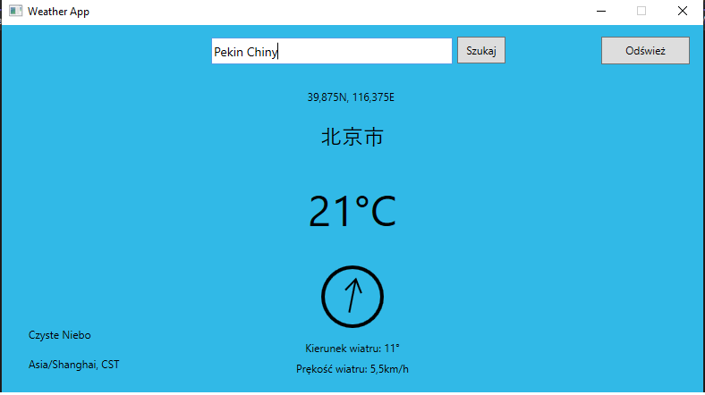
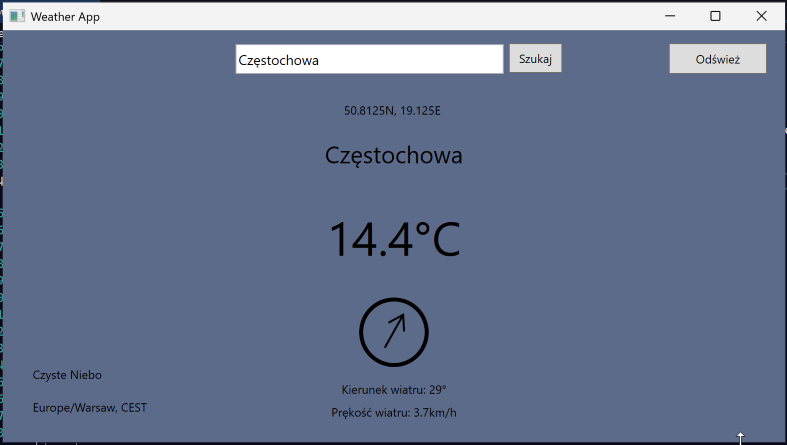

# Dokumentacja projektu.

## Wybrany temat: Aplikacja pokazująca pogodę w zależności od wybranej lokacji.

### Użyte API.

Aplikacja używa dwóch API.

1. Pierwsze z nich to https://open-meteo.com. Wysyłane jest do niego szerokość i długość geograficzna, a zwracany jest dość skomplikowany(i w zależności od opcji w URL) obiekt JSON który jest odwzorowany klasą do której następuje deserializacja z JSONa. Pola muszą mieć dokładnie takie same nazwy jak w odpowiedzi JSON, inaczej nie zostaną zapisane do programu.

2. Drugie z nich to https://photon.komoot.io. Służy do przekonwertowania nazwy miejsca na współrzędne geograficzne, które wysyłam do open-meteo.com. Na ten moment(mogło ulec zmianie od pisania tego), niestety nie wyświetla się lista miejsc o tej samej nazwie a różnych. Kiedy wpiszemy Moscow, nie wyświetli się więc Moskwa, stolica Rosji, tylko jakieś miasteczko w USA. Ale wystarczy wpisać "Moskwa Rosja", aby wyświetliło się poprawne miasto. Można też wpisać angielską transkrypcją "Moskva".
   
    
    To samo tyczy się na przykład Pekinu:
   
   Można też po polsku:
   
   
### Działanie

Aplikacja ma zaimplementowane pobieranie i przypisywanie danych z API w projekcie BLL, który jest biblioteką klas WPF. Za pobieranie danych odpowiada wbudowana biblioteka HTTP(using System.Net.Http), za deserializację JSONa, biblioteka od NewtonSoftu, ponieważ systemowa miała problemy z tablicami. Klasy Weather is GeoCoding(oraz ich pochodne) są wymodelowane a ich pola nazwane według zwracanego obiektu typu JSON.

Zasada jest prosta. Jeżeli interesuje nas pewne pole z JSONa to tworzymy pole o takiej samej nazwie(także wielkość liter ma znaczenie), a podczas deserializacji funkcja automatycznie przypisze pola o tej samej nazwie. Na stronach obu API możemy znaleźć wzór przykładowego zwracanego obiektu. Tak więc obiekt z Open-Meteo wygląda mnie więcej tak:

```json
{  
  "latitude": 52.52,
  "longitude": 13.419,
  "elevation": 44.812,
  "generationtime_ms": 2.2119,
  "utc_offset_seconds": 0,
  "timezone": "Europe/Berlin",
  "timezone_abbreviation": "CEST",
  "current_weather": {
    "time": "2022-07-01T09:00",
    "temperature": 13.3,
    "weathercode": 3,
    "windspeed": 10.3,
    "winddirection": 262
  }

```

więc klasa w C# będzie wyglądać tak:


```csharp

public class Weather {
        public double latitude { get; set; }
        public double longitude { get; set; }
        public double generationtime_ms { get; set; }
        public int utc_offset_seconds { get; set; }
        public string timezone { get; set; }
        public string timezone_abbreviation { get; set; }
        public double elevation { get; set; }
        public CurrentWeather current_weather { get; set; }
	//[...]
	public Weather()
        {
            timezone = "";
            timezone_abbreviation = "GMT";
            current_weather = new CurrentWeather();
        }
}
```

Aby pobrać dane wysyłamy zapytanie GET na stronę i odbieramy odpowiedź, oraz następuje deserializacja do obiektu po szablonie klasy Weather.

```cs
HttpResponseMessage response = await client.GetAsync($"v1/forecast?latitude={lat}&longitude={lon}&current_weather=true&timezone=auto");

response.EnsureSuccessStatusCode();

var empResponse = await response.Content.ReadAsStringAsync();
weather = JsonSerializer.Deserialize<Weather>(empResponse);
```

Teraz możemy użyć danych w MainWindow.xaml.cs.

```csharp
public async Task loadApiAsync(double lat = 50.8, double lon = 19.7)    
{
            try
            {
                weather = await weather.getWeatherAsync(lat, lon);
                
            }
            catch (Exception ex) {
                MessageBox.Show(ex.ToString());
            }
  //[...]
}
```

Wywołujemy geoApi w konstruktorze, która pobiera miasto(domyślnie Częstochowa i zwraca dług. i szer. geograficzną, a następnie wywołujemy loadApiAsync, które ustawi wszystkie pola w GUI).

### GUI


GUI jest proste i składa się z kilku Pól typu Label, jednego TextBoxa, dwóch przycisków.

* **TextBox** - służy do wpisywania nazwy miasta i ew. kraju. Na tym etapie nie rozwija się lista z której można wybrać konkretne miasto(jeżeli jest kilka o tej samej nazwie).
* **Przycisk Szukaj** - Do potwierdzenia wyszukania miasta. Można alternatywnie potwierdzić klawiszem enter.
* **Odśwież** - Odświeża dane na temat pogody.

Na ekranie widać też:

* Stan pogody,
* Strefę czasową
* Współrzędne geograficzne
* Nazwę miasta
* Temperaturę w stopniach Celsjusza
* Zwizualizowany kierunek wiatru
* Prędkość wiatru.

Aplikacja zmienia też kolor na ciemniejszy, przyjemniejszy dla oka w nocy kiedy zmienna z API is_day jest równa 0, a także w zależności od pogody.
```csharp
switch (weather.current_weather.weathercode)
            {
                case 0:
                    s = "Czyste Niebo";
                    MainRectangle.Fill = new SolidColorBrush(Color.FromArgb(225, 22, 176, 228));
                    break;
                case 1:
                    s = "Pojedyncze chmury";
                    MainRectangle.Fill = new SolidColorBrush(Color.FromArgb(225, 22, 176, 228));
                    break;
                case 2:
                    s = "Częściowe zachmurzenie";
                    break;
                case 3:
                    s = "Pochmurno";
                    MainRectangle.Fill = new SolidColorBrush(Color.FromArgb(225, 91, 147, 165));
                    break;
                case 45:
                case 48:
                    s = "Mgliście";
                    MainRectangle.Fill = new SolidColorBrush(Color.FromArgb(225, 91, 147, 165));
                    break;
                case 51:
                case 53:
                case 55:
                    s = "Mżawka";
                    MainRectangle.Fill = new SolidColorBrush(Color.FromArgb(225, 91, 147, 165));
                    break;
                case 56:
                case 57:
                    s = "Zimna mżawka";
                    MainRectangle.Fill = new SolidColorBrush(Color.FromArgb(225, 91, 147, 165));
                    break;
                case 61:
                case 63:
                case 65:
                    s = "Deszcz";
                    MainRectangle.Fill = new SolidColorBrush(Color.FromArgb(255, 80, 95, 126));
                    break;
                case 66:
                case 67:
                    s = "Zimny deszcz";
                    MainRectangle.Fill = new SolidColorBrush(Color.FromArgb(255, 80, 95, 126));
                    break;
                case 71:
                case 73:
                case 75:
                    s = "Śnieg";
                    MainRectangle.Fill = new SolidColorBrush(Color.FromArgb(225, 91, 147, 165));
                    break;
                case 77:
                    s = "Gruby śnieg";
                    MainRectangle.Fill = new SolidColorBrush(Color.FromArgb(225, 91, 147, 165));
                    break;
                case 80:
                case 81:
                case 82:
                    s = "Ulewa";
                    MainRectangle.Fill = new SolidColorBrush(Color.FromArgb(255, 80, 95, 126));
                    break;
                case 85:
                case 86:
                    s = "Zawieja śnieżna";
                    MainRectangle.Fill = new SolidColorBrush(Color.FromArgb(225, 91, 147, 165));
                    break;
                case 95:
                case 96:
                case 99:
                    s = "Burza";
                    MainRectangle.Fill = new SolidColorBrush(Color.FromArgb(255, 80, 95, 126));
                    break;
            }
```




Jeżeli miejca które wpisujemy nie będzie w geocoding API, aplikacja pokaże błąd:
```csharp
 if (geocoding.features.Length != 0)
                {
                    CityLabel.Content = geocoding.features[0].properties.name;
                    await loadApiAsync(geocoding.features[0].geometry.coordinates[1], geocoding.features[0].geometry.coordinates[0]);
                }
                else
                {
                    CityLabel.Content = "Brak takiego miejsca";
                    TempLabel.Content = "-°C";
                    GeoCordsLabel.Content = "0N,";
                    GeoCordsLabel.Content = "0E ";
                    ArrowAngle.Angle = -90.0;
                    WindDirLabel.Content = "Kierunek wiatru: 0°";
                    WindSpeedLabel.Content = "Prękość wiatru: 0 km/h";
                    TimezoneLabel.Content = "UTC0";
                }
```


